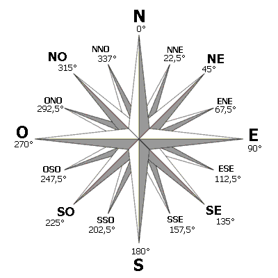

# eedomus script : wind direction


* Version : 2.0
* Origine : [GitHub/Nikya/windDirection](https://github.com/Nikya/eedomusScript_windDirection "Origine sur GitHub")


## Description
*eedomusScript_windDirection* est un script pour la box domotique *eedomus*.

Il permet de convertir une direction de vent en degré vers son équivalent en point cardinal.

Testé avec L'anémomètre / girouette *Oregon Scientific WGR800* .

Le bon fonctionnement de ce script dépend d'une installation correte de la girouette : Orienté correctement vers le Nord.



## Installation via store

Depuis le portail eedomus, cliquez sur `Configuration / Ajouter ou supprimer un périphérique / Store eedomus` puis selectioner _windDirection_.

## Installation manuel
1. Télécharger le projet sur GitHub : [github.com/Nikya/eedomusScript_windDirection](https://github.com/Nikya/eedomusScript_windDirection/archive/master.zip)
1. Uploader le fichier *src/wind_direction.php* sur la box ([Doc eedomus scripts](http://doc.eedomus.com/view/Scripts#Script_HTTP_sur_la_box_eedomus))

### Tester
Ce script peut ensuite être testé au travers du lien suivant dans le navigateur

	http://[ip_de_votre_box]/script/?exec=wind_direction.php&periph=[code_api_perif]

Où il faut remplacer
- *[ip_de_votre_box]* : par l'IP de votre Box *eedomus*
- *[code_api_perif]* : par le code API du capteur qui renvoie la direction du vent en °

Exemple

	http://192.168.1.2/script/?exec=wind_direction.php&periph=999999

### Résultat
Le résultat est au format XML.

Exemple de résultat
```xml
<data>
	<change>2015-Nov-20 14:07:43</change>
	<degree>256</degree>
	<div>22</div>
	<fr>
		<short>OSO</short>
		<long>Ouest-Sud-Ouest</long>
	</fr>
	<en>
		<short>WSW</short>
		<long>West-South-West</long>
	</en>
</data>
```

### Correspondance XPATH

Les différentes informations possibles retournées par les Xpath suivants :

- ```/data/change``` : La date et l'heure de la dernière actualisation du capteur de direction du vent
- ```/data/degree``` : Orientation du vent mesuré en degré (°)
- ```/data/div``` : Division correspondante à l'orientation (360° divisé en  32 divisions numérotées de 0 à 31 dans le sens horaire)
- ```/data/fr/short``` : Orientation du vent exprimé sous forme de *point cardinal* **court** en **français**. Exemple NO
- ```/data/fr/long``` : Orientation du vent exprimé sous forme de *point cardinal* **long** en **français**. Exemple Nord-Ouest
- ```/data/en/short``` : Orientation du vent exprimé sous forme de *point cardinal* **court** en **Anglais**. Exemple NW
- ```/data/en/long``` : Orientation du vent exprimé sous forme de *point cardinal* **long** en **Anglais**. Exemple North-West

## Un exemple d'exploitation avec l'eedomus

Créer un nouveau périphérique de type *HTTP Capteur*

Renseigner les paramètres suivants :

- Type de données : ```Texte```
- URL de la requête : ```http://[VAR1]/script/?exec=wind_direction.php&periph=[VAR2]```
- Chemin XPATH : ```/data/[VAR3]```
- Fréquence de la requête : ```5```
- Variables utilisateur :
	- [VAR1] : ```Localhost```
	- [VAR2] : ```999999``` Le code API du périphérique
	- [VAR3] : ```xx/yyyyy``` Langue et longueur d'affichage `fr` ou `en` et `short` ou `long`
